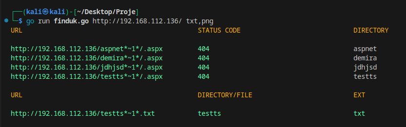

#Introduction
```
It is a tool prepared for IIS Tilde 
Enumeration vulnerability.
```
#Preview


#Installation
```
go install github.com/Privia-Security/finduk@latest
```

#How To Run
```
go run finduk.go http://192.168.112.136/ txt,png
```

#Help
```
Usage: Full URL <extensions>
Example:
        go run finduk.go http://192.168.112.136/ txt,png
```

#Features
```
- find file and directory names
- find file extension
```
